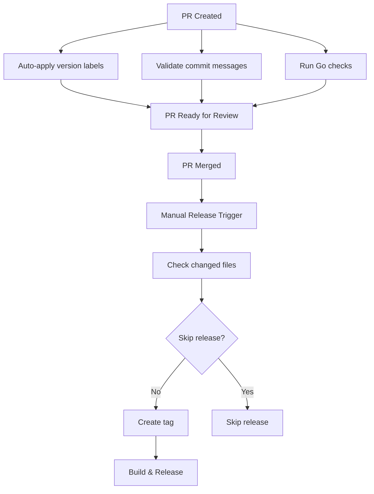

# Reusable GitHub Workflows

A collection of reusable GitHub Actions workflows designed for Go projects, providing comprehensive CI/CD automation including commit validation, code quality checks, semantic versioning, and automated releases.

## Workflows Overview

### 1. 🔍 PR Commit Check (`pr-commit-check.yaml`)

Validates that all commits in a pull request follow the [Conventional Commits](https://www.conventionalcommits.org/) specification.

**Features:**
- Enforces conventional commit format using commitlint
- Supports all standard commit types: `build`, `chore`, `ci`, `docs`, `feat`, `fix`, `perf`, `refactor`, `revert`, `style`, `test`
- Flexible case handling (disables strict case enforcement)
- Automatically ignores dependabot commits and initialization commits
- Provides detailed feedback via sticky PR comments when validation fails
- Auto-removes error comments when issues are resolved

**Usage:**
```yaml
name: "Commit Check on PR"
on:
  pull_request:

permissions:
  pull-requests: write
  contents: read

jobs:
  check_commits:
    uses: forquare/reusable-workflows/.github/workflows/pr-commit-check.yaml@main
```

### 2. 🔧 Go PR Checks (`pr-golang-checks.yaml`)

Performs comprehensive quality checks on Go code in pull requests.

**Features:**
- **Linting**: Uses golangci-lint with latest version, 5-minute timeout, focuses on new issues only
- **Static Analysis**: Runs goreleaser check to validate release configuration
- **Build Validation**: Performs snapshot builds using goreleaser to ensure code compiles correctly
- Uses Go version 1.24+ with fresh builds (cache disabled)

**Usage:**
```yaml
name: "Go Checks on PR"
on:
  pull_request:

jobs:
  check_go:
    uses: forquare/reusable-workflows/.github/workflows/pr-golang-checks.yaml@main
```

### 3. 🏷️ PR Version Label Checks (`pr-version-label-checks.yaml`)

Automatically manages semantic versioning labels on pull requests.

**Features:**
- **Auto-labeling**: Automatically adds `minor` label for `feat` commits, `patch` for others
- **Label Management**: Creates necessary labels if they don't exist (`major`, `minor`, `patch`, `*-bump`)
- **Conflict Resolution**: Removes conflicting version labels and adds appropriate `-bump` labels
- **Validation**: Ensures exactly one version label is present
- **User Feedback**: Provides sticky comments when label requirements aren't met

**Labels Created:**
- `major` - Major version bump (breaking changes)
- `minor` - Minor version bump (new features)
- `patch` - Patch version bump (bug fixes)
- `major-bump`, `minor-bump`, `patch-bump` - Processing labels

**Usage:**
```yaml
name: "Label Check on PR"
on:
  pull_request:
    types:
      - opened
      - reopened
      - synchronize
      - labeled
      - unlabeled

permissions:
  pull-requests: write
  contents: read

jobs:
  check_commits:
    uses: forquare/reusable-workflows/.github/workflows/pr-version-label-checks.yaml@main
```

### 4. 🚀 Release with GoReleaser (`release-with-goreleaser.yaml`)

Automates the release process for Go projects with intelligent release skipping.

**Features:**
- **Smart Release Logic**: Can skip releases based on changed files (using `.github/files_that_skip_release`)
- **Version Bumping**: Automatically creates and pushes tags based on specified release type
- **GoReleaser Integration**: Uses goreleaser for building and publishing releases
- **Three-stage Process**:
  1. File change analysis to determine if release should proceed
  2. Tag creation and version bumping
  3. Build and release execution

**Manual Release Usage:**
```yaml
name: Release
on:
  workflow_dispatch:
    inputs:
      release_type:
        description: 'Release type'
        required: true
        default: 'patch'
        type: choice
        options:
          - patch
          - minor
          - major

permissions:
  contents: write

jobs:
  release:
    uses: forquare/reusable-workflows/.github/workflows/release-with-goreleaser.yaml@main
    with:
      release_type: ${{ github.event.inputs.release_type }}
```

**Automatic Release on Merge Usage:**
```yaml
name: Release on main

on:
  pull_request:
    types: [closed]

permissions:
  contents: write

jobs:
  get_bump_type:
    if: github.ref == 'refs/heads/main' && github.event.pull_request.merged == true
    runs-on: ubuntu-latest
    outputs:
      bump_type: ${{ steps.get_bump_type.outputs.bump_type }}
    steps:
    - id: get_bump_type
      env:
        GITHUB_TOKEN: ${{ secrets.GITHUB_TOKEN }}
      run: |
        BUMP_TYPE=$(gh pr view ${{ github.event.pull_request.number }} --json labels | jq -r '.labels[].name' | grep '[-]bump' | sed 's/-bump$//' | sort | uniq | head -n 1)
        
        echo "bump_type=${BUMP_TYPE}"
        echo "bump_type=${BUMP_TYPE}" >> $GITHUB_OUTPUT

  release:
    needs: get_bump_type
    uses: forquare/reusable-workflows/.github/workflows/release-with-goreleaser.yaml@main
    with:
      release_type: ${{ needs.get_bump_type.outputs.bump_type }}
```

## Complete Workflow Integration

Here's an example of how to use all workflows together in a typical Go project:

```yaml
# .github/workflows/pr.yaml
name: Pull Request Checks
on:
  pull_request:
    types: [opened, synchronize, reopened, labeled, unlabeled]

permissions:
  pull-requests: write
  contents: read

jobs:
  commit-check:
    uses: forquare/reusable-workflows/.github/workflows/pr-commit-check.yaml@main

  version-labels:
    uses: forquare/reusable-workflows/.github/workflows/pr-version-label-checks.yaml@main

  go-checks:
    uses: forquare/reusable-workflows/.github/workflows/pr-golang-checks.yaml@main
```

```yaml
# .github/workflows/release.yaml
name: Release on main

on:
  pull_request:
    types: [closed]

permissions:
  contents: write

jobs:
  get_bump_type:
    if: github.ref == 'refs/heads/main' && github.event.pull_request.merged == true
    runs-on: ubuntu-latest
    outputs:
      bump_type: ${{ steps.get_bump_type.outputs.bump_type }}
    steps:
    - id: get_bump_type
      env:
        GITHUB_TOKEN: ${{ secrets.GITHUB_TOKEN }}
      run: |
        BUMP_TYPE=$(gh pr view ${{ github.event.pull_request.number }} --json labels | jq -r '.labels[].name' | grep '[-]bump' | sed 's/-bump$//' | sort | uniq | head -n 1)
        
        echo "bump_type=${BUMP_TYPE}"
        echo "bump_type=${BUMP_TYPE}" >> $GITHUB_OUTPUT

  release:
    needs: get_bump_type
    uses: forquare/reusable-workflows/.github/workflows/release-with-goreleaser.yaml@main
    with:
      release_type: ${{ needs.get_bump_type.outputs.bump_type }}
```

## Configuration Files

### `.github/files_that_skip_release`

Create this file to define which file changes should skip the release process. Example:

```
# Skip release for documentation-only changes
*.md
docs/**
README*
LICENSE
.gitignore

# Skip for CI/workflow changes
.github/workflows/**
.github/dependabot.yml
```

### `commitlint.config.js` (Optional)

The workflow uses a built-in configuration, but you can override it by creating your own commitlint config in your repository root.

## Requirements

For projects using these workflows:

1. **Go Project**: Must be a Go project with `go.mod`
2. **GoReleaser**: Must have a `.goreleaser.yaml` configuration file
3. **Conventional Commits**: All commits must follow conventional commit format
4. **Permissions**: Repository must allow GitHub Actions to write to pull requests and contents

## Security Features

- **Pinned Actions**: All actions use SHA-pinned versions for security
- **Minimal Permissions**: Each workflow uses only required permissions
- **Dependency Management**: Regular updates via dependabot (recommended)

## Workflow Flow



## Contributing

When contributing to these workflows:

1. Follow conventional commits
2. Test changes thoroughly
3. Update documentation
4. Consider security implications
5. Pin action versions to SHA hashes

## Support

For issues or questions about these workflows, please open an issue in this repository.
