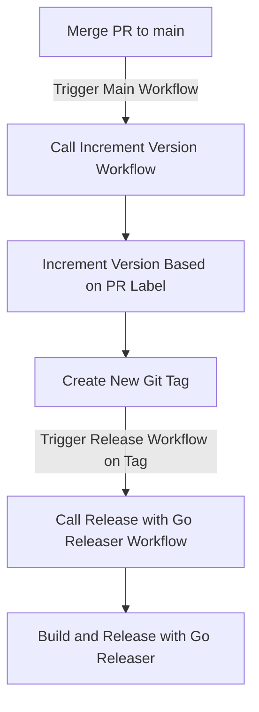

# Reusable Workflows

This is a collection of reusable workflows that Ben uses in his projects.

# GitHub Actions Reusable Workflows for Go Project

This repository contains two reusable workflows for a Go project that uses Go Releaser:

1. **Increment Version Workflow** (`increment-version.yaml`)
2. **Release with Go Releaser Workflow** (`release-with-goreleaser.yaml`)

These workflows automate versioning and releasing based on SemVer (Semantic Versioning) principles.

## Workflows Overview

### 1. Increment Version Workflow (`increment-version.yaml`)

This workflow increments the version of the project based on the specified semantic version part (`major`, `minor`, or `patch`) and tags the repository with the new version. It is intended to be used when a PR is merged into the `main` branch.

#### Inputs

- `semver_part` (required): The part of the version to increment (`major`, `minor`, or `patch`).

#### Example Usage

```yaml
# .github/workflows/main.yaml
name: Main Workflow

on:
  push:
    branches:
      - main

jobs:
  call_increment_version:
    uses: ./.github/workflows/increment-version.yaml
    with:
      semver_part: ${{ github.event.pull_request.labels.* }} # Configure to get the part from PR labels
```

### Release with Go Releaser Workflow (release-with-goreleaser.yaml)

This workflow uses Go Releaser to create a release based on a specific tag. It builds the project and creates the release based on the configuration in the `goreleaser.yml` file.

#### Inputs

- `tag_name` (required): The tag name to use for the release.

#### Example Usage

```yaml
# .github/workflows/release.yaml
name: Release Workflow

on:
  push:
    tags:
      - 'v*'

jobs:
  call_release_with_goreleaser:
    uses: ./.github/workflows/release-with-goreleaser.yaml
    with:
      tag_name: ${{ github.ref_name }}
```

# Workflow Execution Flow

1. Main Workflow Execution:
    - Triggered when a PR is merged into the main branch.
    - Calls the `increment-version.yaml` reusable workflow.
    - Increments the version based on the label applied to the PR (major, minor, or patch).
    - Creates and pushes a new Git tag.
2. Release Workflow Execution:
    - Triggered on the creation of a new Git tag.
    - Calls the `release-with-goreleaser.yaml` reusable workflow.
    - Uses Go Releaser to build the project and publish the release.



This diagram shows the flow of events from merging a PR to the final release using Go Releaser.

# Label Validation Workflow

To ensure proper labeling of pull requests, a separate workflow (`validate-labels.yaml`) ensures that exactly one of the allowed labels (`major`, `minor`, or `patch`) is applied.

## Example Validation Workflow Usage

```yaml
# .github/workflows/pr-validation.yaml
name: PR Label Validation Workflow

on:
  pull_request:
    types: [labeled, unlabeled, opened, reopened, synchronize]

jobs:
  validate_pr_labels:
    uses: ./.github/workflows/validate-labels.yaml
    with:
      valid_labels: ["major", "minor", "patch"]
      pull_request_number: ${{ github.event.pull_request.number }}
```

This workflow helps maintain versioning consistency by enforcing correct labeling rules before merging a PR.
